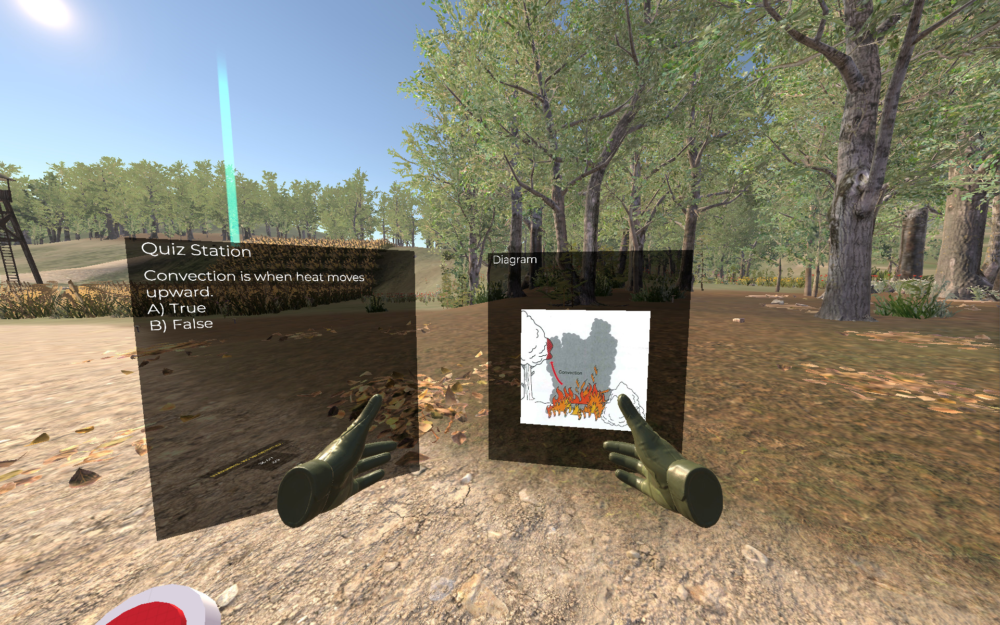
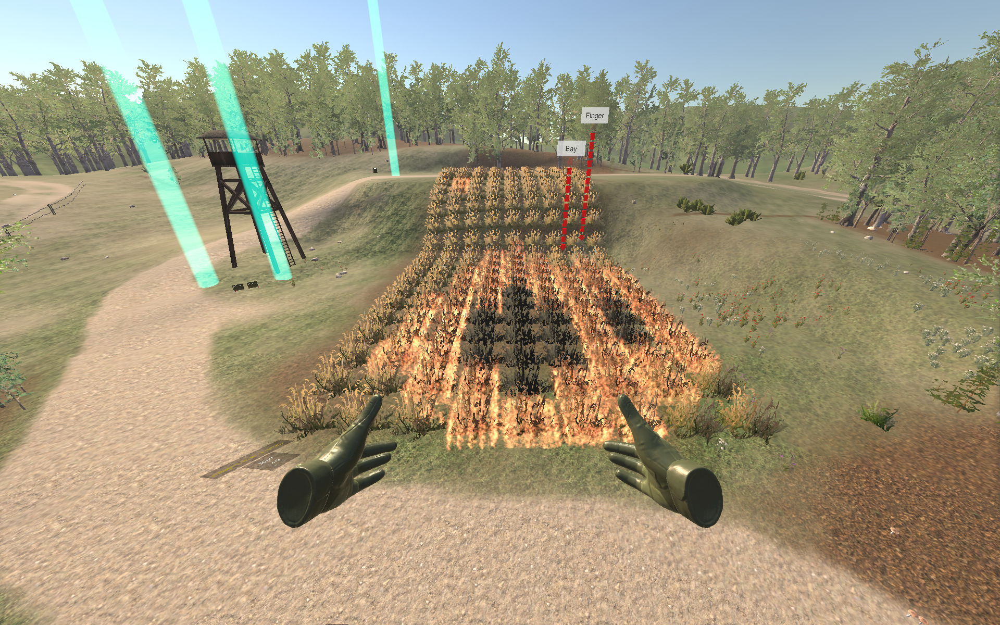
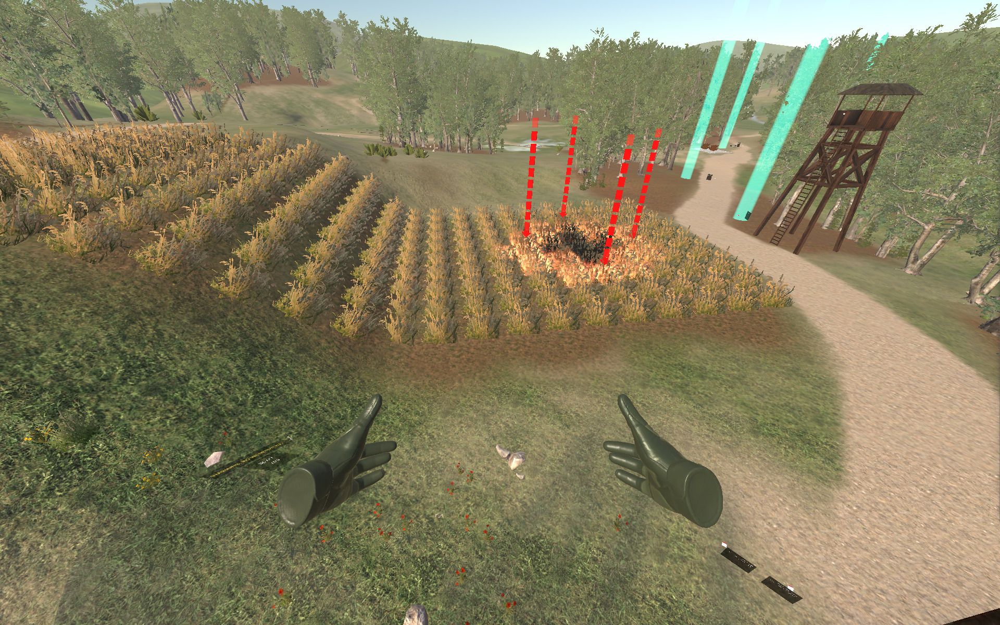
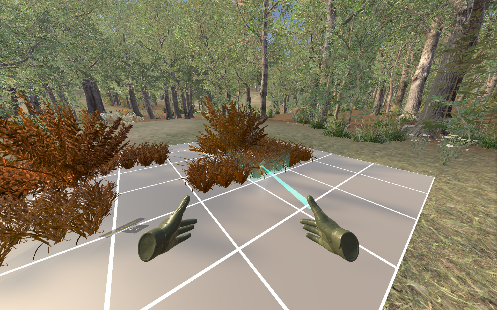
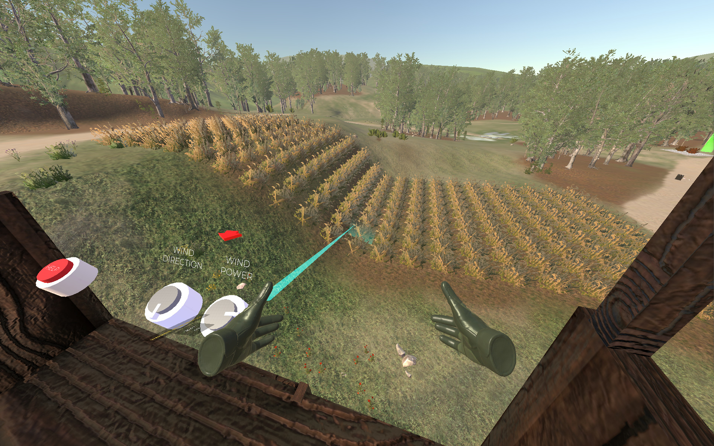

<iframe width="560" height="315" src="https://www.youtube.com/embed/FBuQZ-xmtUs?si=gfGlyBy4IOitGOTS" title="YouTube video player" frameborder="0" allow="accelerometer; autoplay; clipboard-write; encrypted-media; gyroscope; picture-in-picture; web-share" referrerpolicy="strict-origin-when-cross-origin" allowfullscreen></iframe>

## Description

This project explores the feasibility of using virtual reality for training firefighters and focuses on two key research questions. The first focuses on how virtual reality affects learning outcomes and whether it can supplement or replace current training routines. However, the benefits of a technology can only be realised if it is accepted and used. As such, the second research question focuses on identifying the key factors necessary for the technology to see adoption and integration.

For this project, a custom virtual reality learning environment was developed over a year. Set in a forest environment, users learn from various lessons designed to teach core fire and vegetation behaviour concepts. Fire in the environment propagates based on the vegetation’s size and moisture level and is affected by terrain, wind power, and direction. Lessons encourage the user to explore concepts through interactive simulations and visualisations, enabling learners to construct their own knowledge.

### Publications
Two studies have been carried out, one targeting each research question.  55 people have participated, ranging from students with no fire experience to professional firefighters with over 16 years of experience. [The first study](https://www.frontiersin.org/articles/10.3389/fcomp.2024.1274828/full) and the [systematic review](https://www.frontiersin.org/articles/10.3389/frvir.2021.671664/full) of VR training simulations for firefighter training have been published.

### Features
- In-depth design developed using a framework to synergise learner's preferences and VR's features with task and environment design.
- Fire propagation based on wind speed, wind direction, moisture level of fuel, and slope inclination.
- Scripted live demonstrations of fire behaviour.
- Interactive lessons that allow the user to experiment with different simulations.
- Randomised quizzes to encourage reflection and reinforcement.
- In-depth tutorial that covers the environment's controls and tasks. 

## Screenshots

